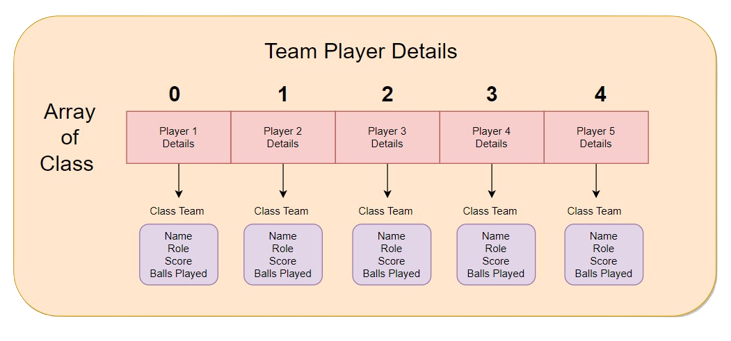

# Hand Cricket

This is a simple Hand-Cricket Game that was built using <strong>Java, OOPs concepts, and Data Structures</strong>. 
The game is based on the popular cricket game that is played in India and other cricket-loving countries.

## Feature

- The game is played between two players, one of whom is the bowler and the other is the batsman.
- The bowler bowls a ball, and the batsman tries to score runs by hitting the ball with his/her hand.
- The game has several levels, each with a different number of overs and target scores.
- The game uses object-oriented programming concepts to create classes for the game, players, overs, and runs.
- The game also uses data structures such as arrays and lists to store and manipulate the game data.

## Getting Started

To run the game on your local machine, follow these steps:

1. Clone the repository to your local machine:
```bash
git clone https://github.com/Utkarsh-Technical/handCricket.git
```

2. Compile the game code:
```bash
javac HandCricket.java 
```

3. Run the game:
```bash
java HandCricket 
```

4. Follow the on-screen instructions to play the game.

## Acknowledgments
- This project was inspired by the popular hand-cricket game played in India and other cricket-loving countries.
- The game uses object-oriented programming concepts and data structures to create a simple, yet fun game.
- The console-based interface makes the game accessible to players who do not have access to a graphical user interface.

## Structure of Code

